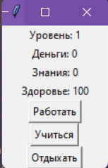

#Лабораторная работа №11.
##Итоговый проект
1. Игра “Симулятор карьеры”.
```python
import tkinter as tk

# Создаем класс для игры
class CareerSimulator:
    def __init__(self):
        self.level = 1
        self.money = 0
        self.knowledge = 0
        self.health = 100

    # Функция для обновления интерфейса
    def update_gui(self):
        level_label.config(text="Уровень: " + str(self.level))
        money_label.config(text="Деньги: " + str(self.money))
        knowledge_label.config(text="Знания: " + str(self.knowledge))
        health_label.config(text="Здоровье: " + str(self.health))

    # Функция для обработки выбора занятия
    def make_choice(self, choice):
        if choice == "работать":
            self.money += 10
            self.knowledge -= 5
            self.health -= 10
        elif choice == "учиться":
            self.money -= 5
            self.knowledge += 10
            self.health -= 10
        elif choice == "отдыхать":
            self.health += 20

        # Проверяем условия повышения уровня или смерти
        if self.money >= 200 and self.knowledge >= 150:
            self.level += 1
            self.money -= 200
            self.knowledge -= 150
        if self.health <= 0:
            self.health = 0
            # Выводим сообщение о смерти и завершаем игру
            messagebox.showinfo("Игра окончена", "Вы умерли!")
            window.destroy()
        # Обновляем интерфейс
        self.update_gui()

# Создаем экземпляр класса игры
game = CareerSimulator()

# Создаем графический интерфейс с помощью библиотеки tkinter
window = tk.Tk()
window.title("Симулятор карьеры")

# Создаем и размещаем элементы интерфейса
level_label = tk.Label(window, text="Уровень: 1")
level_label.pack()

money_label = tk.Label(window, text="Деньги: 0")
money_label.pack()

knowledge_label = tk.Label(window, text="Знания: 0")
knowledge_label.pack()

health_label = tk.Label(window, text="Здоровье: 100")
health_label.pack()

work_button = tk.Button(window, text="Работать", command=lambda: game.make_choice("работать"))
work_button.pack()

study_button = tk.Button(window, text="Учиться", command=lambda: game.make_choice("учиться"))
study_button.pack()

rest_button = tk.Button(window, text="Отдыхать", command=lambda: game.make_choice("отдыхать"))
rest_button.pack()

# Запускаем основной цикл программы
window.mainloop()
```

2. Результат 




