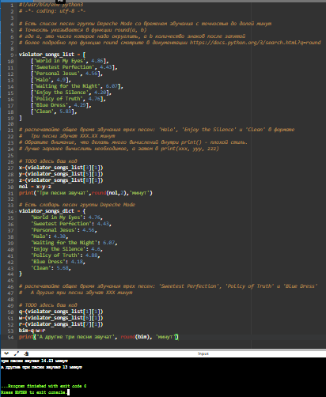

#Лабораторная работа №4.
##Основные типы и операции в Python
1.Написать решение задания 00
``` python
#!/usr/bin/env python3
# -*- coding: utf-8 -*-

# Есть словарь координат городов

sites = {
    'Moscow': (550, 370),
    'London': (510, 510),
    'Paris': (480, 480),
}

# Составим словарь словарей расстояний между ними
# расстояние на координатной сетке - ((x1 - x2) ** 2 + (y1 - y2) ** 2) ** 0.5

distances = {}

# TODO здесь заполнение словаря
for city1 in sites:
    distances[city1] = {}
    for city2 in sites:
        # Вычисляем расстояние по формуле ((x1 - x2) ** 2 + (y1 - y2) ** 2) ** 0.5
        distance = ((sites[city1][0] - sites[city2][0]) ** 2 + (sites[city1][1] - sites[city2][1]) ** 2) ** 0.5
        distances[city1][city2] = distance

print(distances)

```
2.Написать решение задания 01
``` python
#!/usr/bin/env python3
# -*- coding: utf-8 -*-

# Есть значение радиуса круга
radius = 42

# Выведите на консоль значение прощади этого круга с точностю до 4-х знаков после запятой
# подсказки:
#       формулу можно подсмотреть в интернете,
#       пи возьмите равным 3.1415926
#       точность указывается в функции round()
# TODO здесь ваш код
area = round(3.1415926 * radius ** 2, 4)
print(area)

# Далее, пусть есть координаты точки
point_1 = (23, 34)
# где 23 - координата х, 34 - координата у

# Если точка point лежит внутри того самого круга [центр в начале координат (0, 0), radius = 42],
# то выведите на консоль True, Или False, если точка лежит вовне круга.
# подсказки:
#       нужно определить расстояние от этой точки до начала координат (0, 0)
#       формула так же есть в интернете
#       квадратный корень - это возведение в степень 0.5
#       операции сравнения дают булевы константы True и False
# TODO здесь ваш код
distance_1 = (point_1[0]**2 + point_1[1]**2) ** 0.5
inside_1 = distance_1 <= radius
print(inside_1)

# Аналогично для другой точки
point_2 = (30, 30)
# Если точка point_2 лежит внутри круга (radius = 42), то выведите на консоль True,
# Или False, если точка лежит вовне круга.
# TODO здесь ваш код
point_2 = (30, 30)
distance_2 = (point_2[0]**2 + point_2[1]**2) ** 0.5
inside_2 = distance_2 <= radius
print(inside_2)

# Пример вывода на консоль:
#
# 77777.7777
# False
# False
```

3.Написать решение задания 02
``` python
#!/usr/bin/env python3
# -*- coding: utf-8 -*-

# Расставьте знаки операций "плюс", "минус", "умножение" и скобки
# между числами "1 2 3 4 5" так, что бы получилось число "25".
#
# Использовать нужно только указанные знаки операций, но не обязательно все перечесленные.
# Порядок чисел нужно сохранить.

# Пример для чисел "1 2 3" и "9"
# result = (1 + 2) * 3
# print(result)

# TODO написать формулу для 1 2 3 4 5 и вывести значение на консоль
result = ((1 * 2)+ 3 + (4 * 5))
print(result)
```

4.Написать решение задания 03
``` python
#!/usr/bin/env python3
# -*- coding: utf-8 -*-

# Есть строка с перечислением фильмов

my_favorite_movies = 'Терминатор, Пятый элемент, Аватар, Чужие, Назад в будущее'

# Выведите на консоль с помощью индексации строки, последовательно:
#   первый фильм
#   последний
#   второй
#   второй с конца

# Запятая не должна выводиться.  Переопределять my_favorite_movies нельзя
# Использовать .split() или .find()или другие методы строки нельзя - пользуйтесь только срезами,
# как указано в задании!

# TODO здесь ваш код
my_favorite_movies = 'Терминатор, Пятый элемент, Аватар, Чужие, Назад в будущее'
# первый фильм
first_movie = my_favorite_movies[:10]
print(first_movie)

# последний фильм
last_movie = my_favorite_movies[-15:]
print(last_movie)

# второй фильм
second_movie = my_favorite_movies[12:25]
print(second_movie)

# второй с конца фильм
second_last_movie = my_favorite_movies[-22:-17]
print(second_last_movie)
```

5.Написать решение задания 04
``` python
#!/usr/bin/env python3
# -*- coding: utf-8 -*-

# Создайте списки:

# моя семья (минимум 3 элемента, есть еще дедушки и бабушки, если что)
my_family = ['мама','папа','я']


# список списков приблизителного роста членов вашей семьи
my_family_height = [
    # ['имя', рост],
    ['мама',165],
    ['папа',182],
    ['я',161]
]

# Выведите на консоль рост отца в формате
#   Рост отца - ХХ см
print('Рост отца - ',my_family_height[1][1]  , 'см' )

# Выведите на консоль общий рост вашей семьи как сумму ростов всех членов
#   Общий рост моей семьи - ХХ см
print(my_family_height[0][1]+my_family_height[1][1]+my_family_height[2][1])
```

6.Написать решение задания 05
``` python
#!/usr/bin/env python3
# -*- coding: utf-8 -*-

# есть список животных в зоопарке

zoo = ['lion', 'kangaroo', 'elephant', 'monkey', ]

# посадите медведя (bear) между львом и кенгуру
#  и выведите список на консоль
# TODO здесь ваш код
zoo = ['lion', 'kangaroo', 'elephant', 'monkey', ]
zoo.insert(1,'bear')
print(zoo)

# добавьте птиц из списка birds в последние клетки зоопарка
birds = ['rooster', 'ostrich', 'lark', ]
#  и выведите список на консоль
# TODO здесь ваш код
a = zoo + birds
print(a)

# уберите слона
#  и выведите список на консоль
# TODO здесь ваш код
a.remove('elephant')
print(a)
# выведите на консоль в какой клетке сидит лев (lion) и жаворонок (lark).
# Номера при выводе должны быть понятны простому человеку, не программисту.
# TODO здесь ваш код
index_1 = a.index('lion')
index_2 = a.index('lark')
print("Лев сидит в клетке номер", index_1 + 1)
print("Жаворонок сидит в клетке номер", index_2 + 1)

# Покройте реализованную фукциональность тестами с использованием pytest.
def test_insert_bear_between_lion_and_kangaroo():
    zoo = ['lion', 'kangaroo', 'elephant', 'monkey']
    zoo.insert(1, 'bear')
    assert zoo == ['lion', 'bear', 'kangaroo', 'elephant', 'monkey']

def test_add_birds_to_zoo():
    zoo = ['lion', 'kangaroo', 'elephant', 'monkey']
    birds = ['rooster', 'ostrich', 'lark']
    zoo += birds
    assert zoo == ['lion', 'kangaroo', 'elephant', 'monkey', 'rooster', 'ostrich', 'lark']

def test_remove_elephant_from_zoo():
    zoo = ['lion', 'bear', 'kangaroo', 'elephant', 'monkey', 'rooster', 'ostrich', 'lark']
    zoo.remove('elephant')
    assert zoo == ['lion', 'bear', 'kangaroo', 'monkey', 'rooster', 'ostrich', 'lark']

def test_find_lion_and_lark_cells_in_zoo():
    zoo = ['lion', 'bear', 'kangaroo', 'monkey', 'rooster', 'ostrich', 'lark']
    index_1 = zoo.index('lion')
    index_2 = zoo.index('lark')
    assert index_1 + 1 == 1
    assert index_2 + 1 == 7
```

7.Написать решение задания 06
``` python
#!/usr/bin/env python3
# -*- coding: utf-8 -*-

# Есть список песен группы Depeche Mode со временем звучания с точностью до долей минут
# Точность указывается в функции round(a, b)
# где a, это число которое надо округлить, а b количество знаков после запятой
# более подробно про функцию round смотрите в документации https://docs.python.org/3/search.html?q=round

violator_songs_list = [
    ['World in My Eyes', 4.86],
    ['Sweetest Perfection', 4.43],
    ['Personal Jesus', 4.56],
    ['Halo', 4.9],
    ['Waiting for the Night', 6.07],
    ['Enjoy the Silence', 4.20],
    ['Policy of Truth', 4.76],
    ['Blue Dress', 4.29],
    ['Clean', 5.83],
]

# распечатайте общее время звучания трех песен: 'Halo', 'Enjoy the Silence' и 'Clean' в формате
#   Три песни звучат ХХХ.XX минут
# Обратите внимание, что делать много вычислений внутри print() - плохой стиль.
# Лучше заранее вычислить необходимое, а затем в print(xxx, yyy, zzz)

# TODO здесь ваш код
x=(violator_songs_list[3][1])
y=(violator_songs_list[5][1])
z=(violator_songs_list[8][1])
nol = x+y+z
print('Три песни звучат',round(nol,2),'минут')

# Есть словарь песен группы Depeche Mode
violator_songs_dict = {
    'World in My Eyes': 4.76,
    'Sweetest Perfection': 4.43,
    'Personal Jesus': 4.56,
    'Halo': 4.30,
    'Waiting for the Night': 6.07,
    'Enjoy the Silence': 4.6,
    'Policy of Truth': 4.88,
    'Blue Dress': 4.18,
    'Clean': 5.68,
}

# распечатайте общее время звучания трех песен: 'Sweetest Perfection', 'Policy of Truth' и 'Blue Dress'
#   А другие три песни звучат ХХХ минут

# TODO здесь ваш код
q=(violator_songs_list[1][1])
w=(violator_songs_list[6][1])
r=(violator_songs_list[7][1])
bim=q+w+r
print('А другие три песни звучат', round(bim), 'минут')
```

8.Написать решение задания 07
``` python
#!/usr/bin/env python3
# -*- coding: utf-8 -*-

# Есть зашифрованное сообщение

secret_message = [
    'квевтфпп6щ3стмзалтнмаршгб5длгуча',
    'дьсеы6лц2бане4т64ь4б3ущея6втщл6б',
    'т3пплвце1н3и2кд4лы12чф1ап3бкычаь',
    'ьд5фму3ежородт9г686буиимыкучшсал',
    'бсц59мегщ2лятьаьгенедыв9фк9ехб1а',
]

# Нужно его расшифровать и вывести на консоль в удобочитаемом виде.
# Должна получиться фраза на русском языке, например: как два байта переслать.

# Ключ к расшифровке:
#   первое слово - 4-я буква
#   второе слово - буквы с 10 по 13, включительно
#   третье слово - буквы с 6 по 15, включительно, через одну
#   четвертое слово - буквы с 8 по 13, включительно, в обратном порядке
#   пятое слово - буквы с 17 по 21, включительно, в обратном порядке
#
# Обратите вниманме:
#   даны номера букв, а не индексы
#   срез не включает последний индекс
#   подробную информацию об обратных срезах см https://clck.ru/MfEMS
#
# Подсказки:
#   В каждом элементе списка защифровано одно слово.
#   Требуется задать конкретные индексы, например secret_message[3][12:23:4]
#   4е и 5е слова нужно получить за 1 срез
#   Если нужны вычисления и разные пробы - делайте это в консоли пайтона, тут нужен только результат

# TODO вывести расшифрованное сообщение

print(secret_message[0][3],secret_message[1][9:13],secret_message[2][5:15:2],secret_message[3][12:6:-1],secret_message[4][20:15:-1])

```

9.Написать решение задания 08
``` python
#!/usr/bin/env python3
# -*- coding: utf-8 -*-

# в саду сорвали цветы
garden = ('ромашка', 'роза', 'одуванчик', 'ромашка', 'гладиолус', 'подсолнух', 'роза', )

# на лугу сорвали цветы
meadow = ('клевер', 'одуванчик', 'ромашка', 'клевер', 'мак', 'одуванчик', 'ромашка', )

# создайте множество цветов, произрастающих в саду и на лугу
# garden_set =
# meadow_set =
# TODO здесь ваш код
garden_set = set(garden)
print(garden_set)
meadow_set = set(meadow)
print(meadow_set)

# выведите на консоль все виды цветов
# TODO здесь ваш код
print(garden_set|meadow_set)

# выведите на консоль те, которые растут и там и там
# TODO здесь ваш код
print(garden_set&meadow_set)

# выведите на консоль те, которые растут в саду, но не растут на лугу
# TODO здесь ваш код
print(garden_set-meadow_set)

# выведите на консоль те, которые растут на лугу, но не растут в саду
# TODO здесь ваш код
print(meadow_set-garden_set)
```

10.Написать решение задания 09
``` python
#!/usr/bin/env python3
# -*- coding: utf-8 -*-

# Есть словарь магазинов с распродажами

shops = {
    'ашан':
        [
            {'name': 'печенье', 'price': 10.99},
            {'name': 'конфеты', 'price': 34.99},
            {'name': 'карамель', 'price': 45.99},
            {'name': 'пирожное', 'price': 67.99}
        ],
    'пятерочка':
        [
            {'name': 'печенье', 'price': 9.99},
            {'name': 'конфеты', 'price': 32.99},
            {'name': 'карамель', 'price': 46.99},
            {'name': 'пирожное', 'price': 59.99}
        ],
    'магнит':
        [
            {'name': 'печенье', 'price': 11.99},
            {'name': 'конфеты', 'price': 30.99},
            {'name': 'карамель', 'price': 41.99},
            {'name': 'пирожное', 'price': 62.99}
        ],
}

# Создайте словарь цен на продкты следующего вида (писать прямо в коде)
# sweets = {
#     'название сладости': [
#         {'shop': 'название магазина', 'price': 99.99},
#         # TODO тут с клавиатуры введите магазины и цены (можно копипастить ;)
#     ],
#     # TODO тут с клавиатуры введите другую сладость и далее словарь магазинов
# }
# Указать надо только по 2 магазина с минимальными ценами
sweets = {
    'печенье': [
        {'shop': 'пятерочка', 'price': 9.99},
        {'shop': 'магнит', 'price': 11.99}
    ],
    'конфеты': [
        {'shop': 'магнит', 'price': 30.99},
        {'shop': 'ашан', 'price': 34.99}
    ],
    'карамель': [
        {'shop': 'магнит', 'price': 41.99},
        {'shop': 'ашан', 'price': 45.99}
    ],
    'пирожное': [
        {'shop': 'пятерочка', 'price': 59.99},
        {'shop': 'магнит', 'price': 62.99}
    ]
}
```

11.Написать решение задания 10
``` python
#!/usr/bin/env python3
# -*- coding: utf-8 -*-

# Есть словарь кодов товаров

goods = {
    'Лампа': '12345',
    'Стол': '23456',
    'Диван': '34567',
    'Стул': '45678',
}

# Есть словарь списков количества товаров на складе.

store = {
    '12345': [
        {'quantity': 27, 'price': 42},
    ],
    '23456': [
        {'quantity': 22, 'price': 510},
        {'quantity': 32, 'price': 520},
    ],
    '34567': [
        {'quantity': 2, 'price': 1200},
        {'quantity': 1, 'price': 1150},
    ],
    '45678': [
        {'quantity': 50, 'price': 100},
        {'quantity': 12, 'price': 95},
        {'quantity': 43, 'price': 97},
    ],
}

# Рассчитать на какую сумму лежит каждого товара на складе
# например для ламп

lamps_cost = store[goods['Лампа']][0]['quantity'] * store[goods['Лампа']][0]['price']
# или проще (/сложнее ?)
lamp_code = goods['Лампа']
lamps_item = store[lamp_code][0]
lamps_quantity = lamps_item['quantity']
lamps_price = lamps_item['price']
lamps_cost = lamps_quantity * lamps_price
print('Лампа -', lamps_quantity, 'шт, стоимость', lamps_cost, 'руб')

# Вывести стоимость каждого вида товара на складе:
# один раз распечать сколько всего столов и их общая стоимость,
# один раз распечать сколько всего стульев и их общая стоимость,
#   и т.д. на складе
# Формат строки <товар> - <кол-во> шт, стоимость <общая стоимость> руб

# WARNING для знающих циклы: БЕЗ циклов. Да, с переменными; да, неэффективно; да, копипаста.
# Это задание на ручное вычисление - что бы потом понять как работают циклы и насколько с ними проще жить.

# TODO здесь ваш код

lamps_item = store[goods['лампа']][0]
lamps_quantity = lamps_item['quantity']
lamps_price = lamps_item['price']
lamps_cost = lamps_quantity * lamps_price

table_item1 = store[goods['стол']][0]
table_item2 = store[goods['стол']][1]
table_quantity = table_item1['quantity'] + table_item2['quantity']
table_price = table_item1['price'] + table_item2['price']
table_cost = table_quantity * table_price

sofa_item1 = store[goods['диван']][0]
sofa_item2 = store[goods['диван']][1]
sofa_quantity = sofa_item1['quantity'] + sofa_item2['quantity']
sofa_price = sofa_item1['price'] + sofa_item2['price']
sofa_cost = sofa_quantity * sofa_price

chair_item1 = store[goods['стул']][0]
chair_item2 = store[goods['стул']][1]
chair_item3 = store[goods['стул']][2]
chair_quantity = chair_item1['quantity'] + chair_item2['quantity'] + chair_item3['quantity']
chair_price = chair_item1['price'] + chair_item2['price'] + chair_item3['price']
chair_cost = chair_quantity * chair_price


print('лампа -', lamps_quantity, 'шт, стоимость', lamps_cost, 'руб')
print('стол -', table_quantity, 'шт, стоимость', table_cost, 'руб')
print('диван -', sofa_quantity, 'шт, стоимость', sofa_cost, 'руб')
print('стул -', chair_quantity, 'шт, стоимость', chair_cost, 'руб')

```


12. Результаты решений:

Решение к заданию 00:

Решение к заданию 01:

Решение к заданию 02:

Решение к заданию 03:

Решение к заданию 04:

Решение к заданию 05:

Решение к заданию 06:

Решение к заданию 07:

Решение к заданию 08:

Решение к заданию 09:

Решение к заданию 10:

