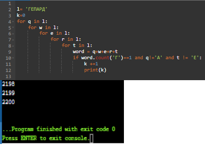
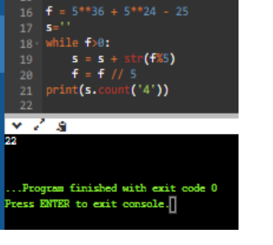
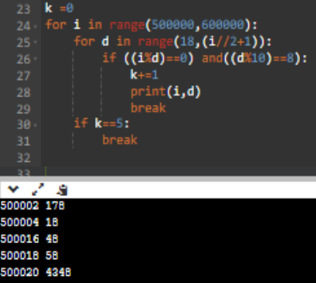

#Лабораторная работа №6.
##Расчётные задачи. Itertools
1.Программа, решающая задачу

1) Ученица составляет 5-буквенные слова из букв ГЕПАРД. При этом в каждом слове ровно одна буква Г, слово не может начинаться на букву А и заканчиваться буквой Е. Какое количество слов может составить ученица?
```python
l= 'ГЕПАРД'
k=0
for q in l:
    for w in l:
        for e in l:
            for r in l:
                for t in l:
                    word = q+w+e+r+t
                    if word.count('Г')==1 and q!='А' and t != 'Е':
                        k +=1
                        print(k)
```
2) Значение выражения 5^36 + 5^24 -25 записали в системе счисления с основанием 5. Сколько цифр 4 содержится в этой записи?
```python
f = 5**36 + 5**24 - 25
s=''
while f>0:
    s = s + str(f%5)
    f = f // 5
print(s.count('4'))
```
3) Найдите 5 чисел больших 500000, таких, что среди их делителей есть число, оканчивающееся на 8, при этом этот делитель не равен 8 и самому числу. В качестве ответа приведите 5 наименьших чисел, соответствующих условию.
```python

k =0
for i in range(500000,600000):
    for d in range(18,(i//2+1)):
        if ((i%d)==0) and((d%10)==8):
            k+=1
            print(i,d)
            break
    if k==5:
        break
```
2.Результаты рещений







