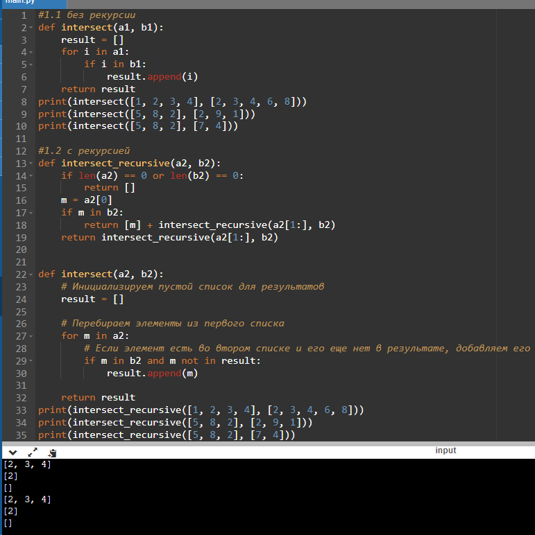
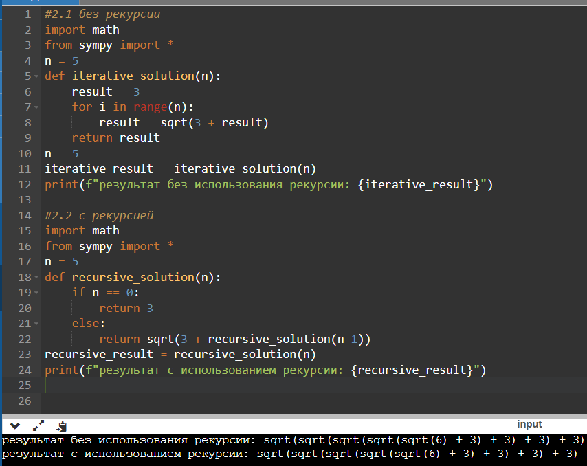

#Лабораторная работа №7.
##Рекурсия
1.Программа, решающая задачу

 Функция для нахождения пересечения двух списков.
```python
# >>> intersect([1, 2, 3, 4], [2, 3, 4, 6, 8])
# [2, 4]
# >>> intersect([5, 8, 2], [2, 9, 1])
# [2]
# >>> intersect([5, 8, 2], [7, 4])
# []

#1.1 без рекурсии
def intersect(a1, b1):
    result = []
    for i in a1:
        if i in b1:
            result.append(i)
    return result
print(intersect([1, 2, 3, 4], [2, 3, 4, 6, 8]))
print(intersect([5, 8, 2], [2, 9, 1]))
print(intersect([5, 8, 2], [7, 4]))

#1.2 с рекурсией
def intersect_recursive(a2, b2):
    if len(a2) == 0 or len(b2) == 0:
        return []
    m = a2[0]
    if m in b2:
        return [m] + intersect_recursive(a2[1:], b2)
    return intersect_recursive(a2[1:], b2)
def intersect(a2, b2):
    # Инициализируем пустой список для результатов
    result = []
    # Перебираем элементы из первого списка
    for m in a2:
        # Если элемент есть во втором списке и его еще нет в результате, добавляем его
        if m in b2 and m not in result:
            result.append(m)
    return result
print(intersect_recursive([1, 2, 3, 4], [2, 3, 4, 6, 8]))
print(intersect_recursive([5, 8, 2], [2, 9, 1]))
print(intersect_recursive([5, 8, 2], [7, 4]))
```

Функция для расчёта 

```python
#2.1 без рекурсии
import math
from sympy import *
n = 5
def iterative_solution(n):
    result = 3
    for i in range(n):
        result = sqrt(3 + result)
    return result
n = 5
iterative_result = iterative_solution(n)
print(f"результат без использования рекурсии: {iterative_result}")

#2.2 с рекурсией
import math
from sympy import *
n = 5
def recursive_solution(n):
    if n == 0:
        return 3
    else:
        return sqrt(3 + recursive_solution(n-1))
recursive_result = recursive_solution(n)
print(f"результат с использованием рекурсии: {recursive_result}")
```


2. Результаты решений:


