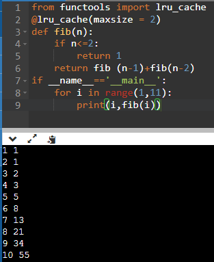
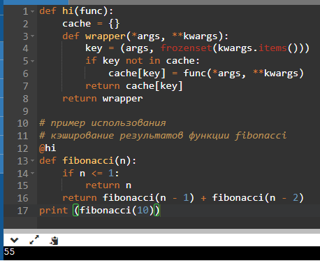

#Лабораторная работа №8.
##Замыкания
1.Программа, решающая задачу

Замыкание реализующее последовательность Фибоначчи.
```python
from functools import lru_cache
@lru_cache(maxsize = 2)
def fib(n):
    if n<=2:
        return 1
    return fib (n-1)+fib(n-2)
if __name__=='__main__':
    for i in range(1,11):
        print(i,fib(i))
```

Декоратор для кэширования результатов выполнения функций.
```python
def hi(func):
    cache = {}  
    def wrapper(*args, **kwargs):
        key = (args, frozenset(kwargs.items()))  
        if key not in cache:
            cache[key] = func(*args, **kwargs)
        return cache[key]
    return wrapper

# пример использования
# кэширование результатов функции fibonacci
@hi
def fibonacci(n):
    if n <= 1:
        return n
    return fibonacci(n - 1) + fibonacci(n - 2)
fibonacci(10)
```

2. Результаты решений:



