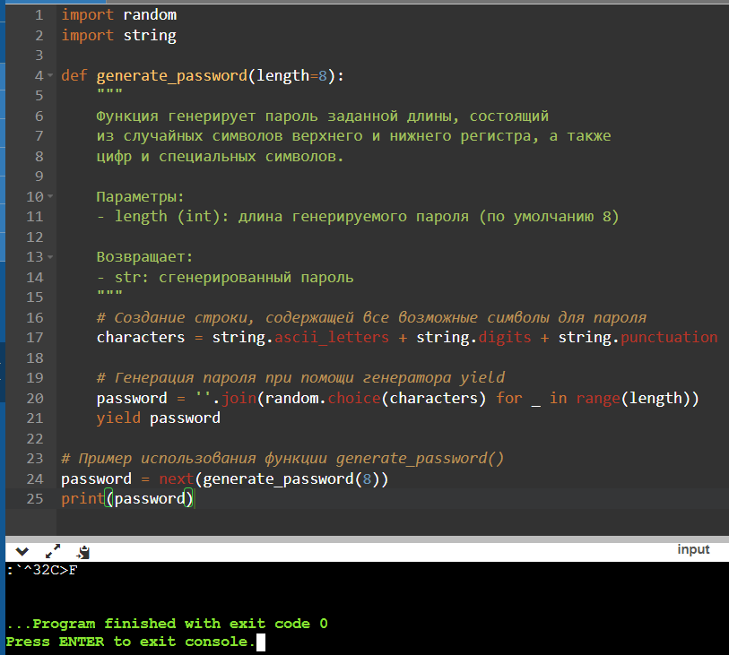

#Лабораторная работа №9.
##Генераторы
1.Программа, решающая задачу
Генератор, создающий пароли по определённым правилам.
```python
import random
import string

def generate_password(length=8):
    """
    Функция генерирует пароль заданной длины, состоящий
    из случайных символов верхнего и нижнего регистра, а также
    цифр и специальных символов.

    Параметры:
    - length (int): длина генерируемого пароля (по умолчанию 8)

    Возвращает:
    - str: сгенерированный пароль
    """
    # Создание строки, содержащей все возможные символы для пароля
    characters = string.ascii_letters + string.digits + string.punctuation

    # Генерация пароля при помощи генератора yield
    password = ''.join(random.choice(characters) for _ in range(length))
    yield password

# Пример использования функции generate_password()
password = next(generate_password(8))
print(password)
```

2. Результаты решений:


